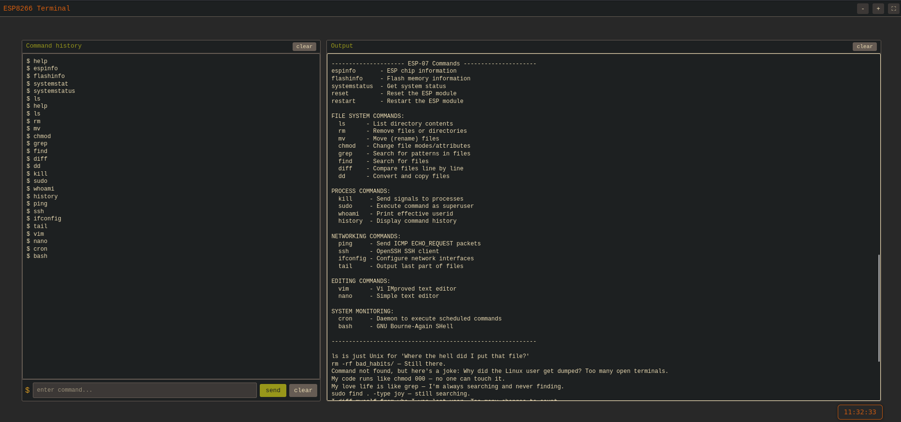

## Description

This project uses the **ESP-07** microcontroller paired with a **SIM800 GSM** module to securely control a relay via SMS. When an SMS is received, the system verifies both the sender's phone number and a predefined secret string. If the message comes from an authorized administrator, the relay is activated.

In addition to SMS control, the ESP-07 hosts a lightweight **web terminal** accessible over Wi-Fi. Styled with a **Gruvbox-inspired Vim theme**, the terminal provides a command-line-like interface with built-in help commands, diagnostics, and fun "fake" Unix-style commands. You can also send raw AT commands to the SIM800 directly from the web UI.

Ideal for remote control, home automation, or offline IoT applications where internet connectivity is limited or unavailable.


&nbsp;

---
## How It Works

1. **Initialization**  
   ESP-07 initializes SIM800L and configures SMS reception in text mode.

2. **SMS Handling**  
   - Extract sender number
   - Verify against a predefined `ADMIN_NUMBER`
   - Validate against a `SECRET_CODE`

3. **Relay Activation**  
   - If validation passes: Relay is triggered via GPIO12
   - If not: SMS is ignored

4. **WebShell Access**  
   Minimal web server with a terminal UI replicating serial-style command interface in-browser.


&nbsp;

---
## 🌐 Web Terminal Features

Styled with the **Vim Gruvbox** theme, this web terminal supports:

- `help`, `helpesp`, `helpsim` → Show available commands
- `espinfo`, `systemstatus`, `listfiles` → ESP diagnostics
- `cmd <AT>` → Send raw AT commands to SIM800
- Fun Unix-style commands (`vim`, `ls`, `sudo`, `grep`) with humorous output




&nbsp;

#### Fun Unix Commands with a Twist

To make things more playful, common Linux commands output tech jokes when typed. For example:
- `grep` → _“My love life is like grep — I'm always searching and never finding.”_
- `sudo` → _“I would make a joke about sudo, but you'd have to be root to get it.”_
- `vim` → _“I entered VIM 3 days ago. Send help.”_
- `ls` → _“ls: because I forgot what I just created 5 seconds ago.”_

&nbsp;

---
## Circuit Connections

### ESP-07 ↔ SIM800L


```
                       ESP-07                   SIM800 GSM
                   Microcontroller                Module
                    .-----------.              .-----------.
                    |           |              |           |   VCC 5V
   GND      +-----> | GPIO-15   |     GND      |           |----------->
 -----------+-----> | GND       | -----------> |           |   GND
                    |           |              |           |----------->
                    |           |              |           |
            +-----> | EN        |              |           |
    VCC     +-----> | RST       |              |           |
 -----------+-----> | VCC       |              |           |
                    |           |              |           |
                    |           |              |           |
                    |    RX (4) | -----------> | SIM800 TX |
                    |    TX (5) | -----------> | SIM800 RX |
                    ,-----------,              ,-----------,

Legend:
- EN (Enable):
  - Connect the EN pin of the ESP-07 to 3.3V. 
  - This pin must be high for the ESP-07 to function.

- RST (Reset):
  - Connect the RST pin of the ESP-07 to 3.3V.
  - This ensures the module is not held in reset mode.

- GND: Ensure GND pins of both devices are connected.

- GPIO 15:
  - Connect the GPIO 15 pin of the ESP-07 to GND.
  - This is a boot configuration pin that must be grounded,
    for the ESP-07 to boot into the correct mode.
```

&nbsp;

**Power Requirements**
- **ESP-07:** 3.3V
- **SIM800L:** 4V–5V (separate power supply recommended)
- Ensure adequate current supply during GSM transmission (peaks ~2A)


💡 **Tip:**  
If you're using a **single 4V power source** (e.g., Li-Ion battery), you can safely power the **ESP-07** by placing a **standard silicon diode (e.g., 1N4007)** in series with the VCC line. The diode drops the voltage by approximately **0.7V**, bringing the 4V down to ~**3.3V**, which is ideal for the ESP-07.


&nbsp;

### ESP ↔ 2N2222 NPN Transistor ↔ Relay
```
        +3.3V
          |
          |
          |            Relay VCC
          +---------+-----------+               +----------------------+
          |         |           |               |                      |
          |      .-------.---------------------------.                 |
 Cathode  |      |       |     COM1    NO1     NC1   |                 |
         ___     |       |                           |                LED
  1N4007 / \     | Relay |        Relay Coil         |                 |
         ---     |       |                           |                .-.
   Anode  |      |       |     COM2    NO2     NC2   |                | | 220Ω
          |      '-------'---------------------------'                | |
          |          |                                                '-'
          +----------|                                                 |
                     |                                                GND
                     |
                     | (C) Collector
             1kΩ    |/
ESP GPIO12----------|   2N2222
                    |\
                     | (E) Emitter
                     |
                     |
                     |
                    GND

2N2222 Emitter (E) ---> GND
2N2222 Collector (C) --> Relay Coil Negative (GND side)
Relay Coil Positive --> +3.3V

Flyback Diode (1N4007)
- Anode → Collector
- Cathode → +3.3V
```

&nbsp;

---
## Dependencies

### Components Required
- **ESP8266Burn debugger** for programing ESP-07
-  ESP-07 (ESP8266-based Wi-Fi module)
- SIM800 GSM Module
- 2N2222 NPN Transistor
- 1N4007 Diodes (Flyback protection)
- 220Ω & 1kΩ Resistors
- Relay Module (or standalone relay)
- 3.7V–4.2V Li-Ion Battery (External power for GSM)

&nbsp;
### Software
- **Arduino IDE 2.x** – Required for flashing the ESP-07 firmware.
- **ESP8266 Board Package** – Required for compiling and uploading firmware to the ESP-07.
- **ArduinoJson Library** – Parses and structures commands sent to the ESP-07.
- **SoftwareSerial** – Enables serial communication on other digital pins (not just the hardware serial port).
- **DNSServer** – Provides DNS server capabilities, often used in captive portals.
- **ESP8266WiFi** – Core library for handling Wi-Fi on ESP8266 boards.
- **ESPAsyncTCP** – Asynchronous TCP library, improves performance for TCP communication.
- **ESPAsyncWebServer** – Asynchronous HTTP server for serving web pages or APIs without blocking the main loop.
- **LittleFS** – Filesystem library for reading/writing files on the ESP8266's internal flash storage.
- **FS** – General filesystem interface, used as a base for specific file systems like LittleFS.
- **secrets.h** – Header file containing sensitive data such as Wi-Fi credentials (excluded from version control).

&nbsp;

---
# ESP-07 Firmware Installation Guide

This guide provides step-by-step instructions for setting up the Arduino IDE, installing dependencies, and flashing the ESP-07 module.

&nbsp;
## 1. Setting Up Arduino IDE 2.x

### Install the ESP8266 Board Package
1. Open **Arduino IDE 2.x**.
2. Navigate to **File > Preferences**.
3. Add the following URL under **Additional Board Manager URLs**: `http://arduino.esp8266.com/stable/package_esp8266com_index.json`
4. Go to **Tools > Board > Board Manager**, search for `ESP8266`, and install it.

&nbsp;
### Install Required Libraries
Open the **Library Manager** (**Tools > Library Manager**) and install:

- **ArduinoJson** *(Benoit Blanchon)*  
Used for parsing and creating structured JSON data.

- **SoftwareSerial** *(Arduino)*  
Provides additional serial ports using digital pins.

- **DNSServer** *(Part of ESP8266 core)*  
Included automatically; no separate installation needed.

- **ESP8266WiFi** *(Part of ESP8266 core)*  
Handles Wi-Fi operations (AP/STA modes).

&nbsp;
### Install Asynchronous Networking Libraries (Manual Installation)
These libraries must be installed manually:

&nbsp;
#### **ESPAsyncTCP**
1. Download from GitHub:  
[https://github.com/me-no-dev/ESPAsyncTCP](https://github.com/me-no-dev/ESPAsyncTCP)
2. Extract and place the folder in your Arduino `libraries` directory:
- **Windows**: `Documents\Arduino\libraries\ESPAsyncTCP`
- **Linux/macOS**: `~/Arduino/libraries/ESPAsyncTCP`

&nbsp;
#### **ESPAsyncWebServer**
1. Download from GitHub:  
[https://github.com/me-no-dev/ESPAsyncWebServer](https://github.com/me-no-dev/ESPAsyncWebServer)
2. Place the extracted folder in the same `libraries` directory.

⚠️ **Note**: `ESPAsyncWebServer` requires both `ESPAsyncTCP` and `ESP8266WiFi`.

&nbsp;
### Restart Arduino IDE
After installation, restart the IDE to apply changes.

&nbsp;

---
## 2. Flashing the ESP-07

### Uploading the Sketch
1. Open `esp-relay.ino` in Arduino IDE.
2. Place the `data` folder (containing HTML/scripts) in the same directory as the sketch.
3. Connect the ESP-07 via an **ESP8266Burn debugger**.
4. Select the correct **ESP8266 board** and **COM port** in the IDE.
5. Upload the sketch.

&nbsp;
### Uploading Files to LittleFS
To upload the `data` folder to the ESP-07's filesystem:

&nbsp;
#### Install the LittleFS Uploader Plugin
1. Download the plugin `.vsix` file from:  [Releases Page](https://github.com/earlephilhower/arduino-littlefs-upload/releases/download/1.5.3/arduino-littlefs-upload-1.5.3.vsix)
2. Place the file in:
- **Windows**: `C:\Users\<username>\.arduinoIDE\plugins\`
- **Linux/macOS**: `~/.arduinoIDE/plugins/` (create the folder if missing).
3. Restart Arduino IDE.
4. Verify installation by pressing **Ctrl + Shift + P** and searching for:   **`Upload Little FS to Pico/ESP8266/ESP32`**.

&nbsp;
#### Upload Files
1. Use the command above to upload the `data` folder contents to LittleFS.

&nbsp;

---
## Configuration via `secrets.h`

The `secrets.h` file contains sensitive and customizable parameters for the ESP-07. **You must modify this file** before flashing the firmware to match your environment. Below are the key configurations:

### 1. **Wi-Fi Credentials**
The ESP-07 operates in **dual mode**:
- **STA (Station) Mode**: Connects to your local Wi-Fi network for debugging/internal communication.
- **AP (Access Point) Mode**: Creates a fallback Wi-Fi network if STA mode fails (e.g., no Wi-Fi available).

&nbsp;

#### **Local Wi-Fi (STA Mode)**
- Replace these with your home/office network credentials:
```cpp
#define LOCAL_SSID "MyWiFiNetwork"    // Your Wi-Fi SSID
#define LOCAL_PASS "password1234"     // Your Wi-Fi password
```
- If connection fails, the ESP-07 switches to AP mode automatically.


&nbsp;

#### **Access Point (AP Mode)**
Predefined fallback network (change if needed):
```cpp
#define AP_SSID "ESP8266-Access-Point"  // Default AP SSID
#define AP_PASS "123456789"             // Default AP password
```
Devices can connect to this network to access the ESP-07’s web interface at `http://192.168.1.1`.


&nbsp;

### 2. **SMS Authentication**
Used for validating commands sent via SMS (e.g., relay control):
```cpp
const String ADMIN_PHONE = "+38160123456789"; // Admin’s phone number (authorized sender)
const String SECRET_COMMAND = "openrelay";    // Secret keyword to activate the relay
```

- **How it works**:
    - The ESP-07 checks if an incoming SMS is from `ADMIN_PHONE` and contains `SECRET_COMMAND`.
    - If both match, the command (e.g., triggering a relay) is executed.


&nbsp;

## Security Notes

- 🔒 Change the default `AP_PASS` and `SECRET_COMMAND` in production.
- 📱 Ensure `ADMIN_PHONE` uses the full international format (e.g., `+38160...`).
- 📶 If STA mode fails, the ESP-07 remains accessible via AP mode for configuration.
    
For advanced security, consider encrypting SMS commands or using HTTPS for the web interface.

&nbsp;

---
## 🏁 Conclusion

This project demonstrates how to combine GSM and Wi-Fi tech in a secure offline-capable IoT system. The modular design makes it easy to scale or customize for your specific remote control and automation needs.

&nbsp;

---
## License
- This project is licensed under the MIT License. See the [LICENSE](https://github.com/Im0nk3yar0und/esp-relay/blob/main/LICENSE) file for details.

&nbsp;

---
## Disclaimer
- This project is for educational and research purposes only.
- The author is not responsible for any misuse, legal issues, or unintended consequences.
- **Use responsibly!** ⚠️
